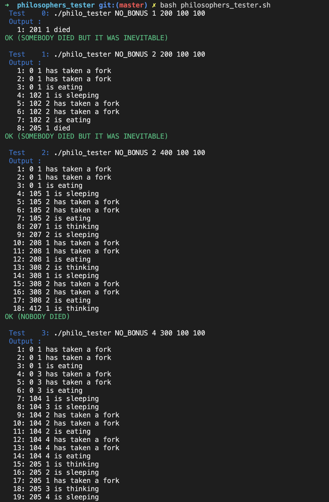

# Philosophers Tester - 42Lisbon

To clone with submodules: `git clone --recursive <project url>`

## How to use it

- Run `bash philosophers_tester.sh`.

- The evaluated program should be named `philo` and be in the directory `philo` located next to the directory `philosophers_tester`.

- The bonus program program should be named `philo_bonus` and be in the directory `philo_bonus` located next to the directory `philosophers_tester`.

- The programm will set `nb_of_times_every_philo_must_eat` to `7` as default value.

- To change those default paths and values modify `philo_path`, `philo_bonus_path` and `default_nb_meals` in `philosophers_tester.sh`.

- By default the tester will show also the output of the philo program, to toggle it modifiy `SHOW_PHILO_OUTPUT` in `headers/philosophers_tester.h` and recompile with `make re`.

- If you want to add some custom tests feel free to do so, it's very easy. Just edit `init_tests.sh`.

## Disclaimer
- Memory allocations/leaks are not tested
- The tester doesn't work for bonus, this is probably due to `eval` execution of the command in `tester_loop.sh`, it probably can be fixed easly if you know how to execute a command with arguments starting by a string that contains both.
- The tester is very strict about available forks evalutation and won't tollerate a philosopher taking a fork before the one having it explicitely stated he released it (by printing a status change to sleep).
- The program may (probably) have bugs and issues, be aware and use your own judgement when in doubt, also please feel free to reach me for feedback or bugs report.
